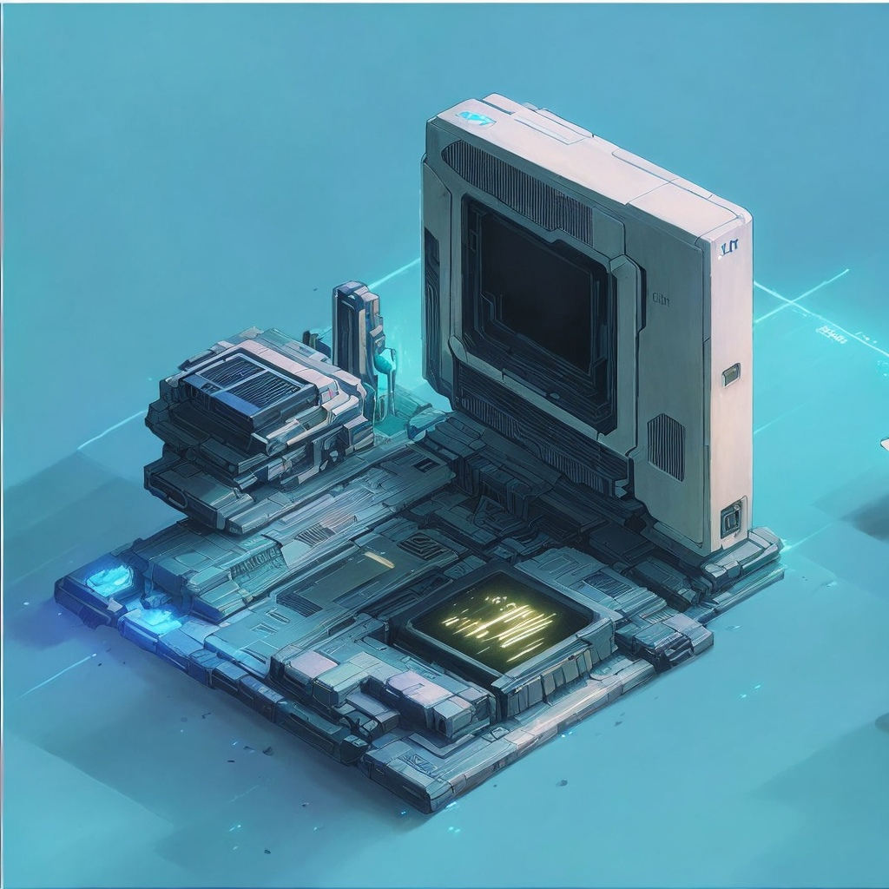

# PC Builder - Телеграм Бот

PC Builder - это Телеграм-бот, разработанный для помощи в подборе оптимальной конфигурации компьютера в рамках вашего бюджета. Он учитывает ваши предпочтения и предлагает варианты модификаций для выбора компонентов.

## Возможности

- **Индивидуальная сборка ПК:** PC Builder создает персонализированные сборки компьютеров на основе ваших предпочтений и требований.
- **Рекомендации с учетом бюджета:** Независимо от вашего бюджета, PC Builder гарантирует оптимальное соотношение цены и производительности, максимизируя ценность для ваших средств.
- **Широкий выбор компонентов:** PC Builder предлагает разнообразный ассортимент компонентов от ведущих производителей, обеспечивая надежность и производительность. Он предоставляет различные модификации и варианты для каждого компонента, чтобы настроить сборку по вашему вкусу.
- **Интеллектуальный алгоритм:** Бот использует умный алгоритм, который учитывает ваши предпочтения и требования. Он анализирует ваши ответы и предлагает лучшие варианты, соответствующие вашим потребностям.
- **Разнообразие сфер применения:** Независимо от того, нужно ли вам обновить систему или собрать компьютер для игр, работы или творчества, PC Builder поможет вам.

## Как использовать

1. Начните чат с PC Builder в Telegram.
2. Укажите свой бюджет и ответьте на ряд вопросов о ваших предпочтениях, таких как предполагаемое использование, желаемые характеристики и эстетика.
3. PC Builder проанализирует ваши ответы и сгенерирует рекомендацию по индивидуальной сборке компьютера, соответствующую вашим требованиям.
4. Ознакомьтесь с предложенными компонентами и модификациями, предоставленными PC Builder.
5. Измените сборку в соответствии с вашими предпочтениями, выбрав альтернативные компоненты или изменяя характеристики.
6. Когда вы будете удовлетворены конфигурацией, PC Builder предоставит вам подробную информацию о каждом компоненте, включая цены и совместимость.
7. Используйте предоставленную информацию, чтобы принять обоснованное решение и приступить к покупке компонентов для вашего мечтательного компьютера.

## Начать

Хотите превратить свою мечту о компьютере в реальность? Подключитесь к PC Builder в Telegram уже сегодня и насладитесь процессом создания индивидуального ПК, полностью отвечающего вашим потребностям и предпочтениям.

[Начать общение с PC Builder](https://t.me/buildYourPC_bot)

## О нас

PC Builder разработан командой энтузиастов, увлеченных компьютерами, которые понимают важность правильного подбора компонентов для безупречного компьютерного опыта. Наша миссия - упростить процесс сборки компьютера и помочь пользователям принимать обоснованные решения.

По любым вопросам или для получения поддержки, пожалуйста, не связывайтесь с нашей командой.

Мы с нетерпением ждем возможности помочь вам сборкой вашего мечтательного компьютера!

